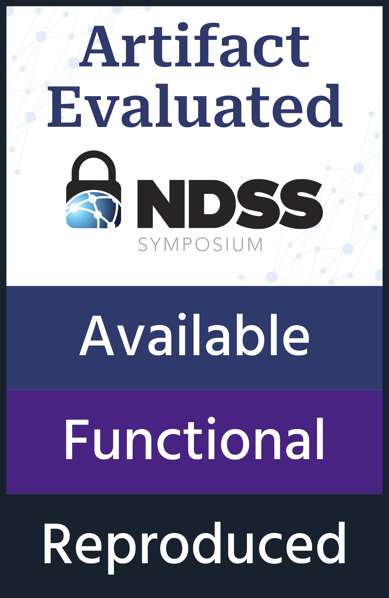
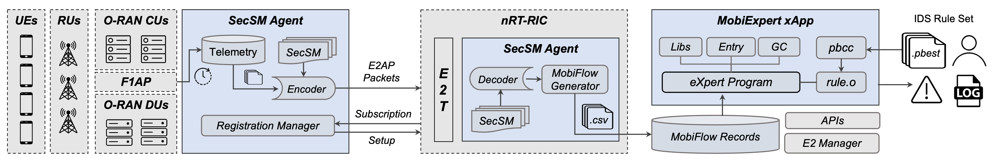

# 5G-Spector

[](https://doi.org/10.5281/zenodo.10154551)

5G-Spector is the first Open Radio Access Network ([O-RAN](https://www.o-ran.org/)) compliant layer-3 cellular attack detection service. It is based on the revolutionary O-RAN architecture that brings unprecedented programmability that enables stakeholders (e.g., network operators) and researchers to build innovative software-defined services on cellular networks. 5G-Spector is featured in project [SE-RAN](https://5gsec.com) and an academic publication in the Network and Distributed System Security Symposium 2024 ([NDSS 2024](https://www.ndss-symposium.org/ndss2024/)). The full paper is available [here](https://web.cse.ohio-state.edu/~wen.423/papers/5G-Spector-NDSS24.pdf).

5G-Spector has passed the NDSS'24 artifact evaluation and is awarded all badges (available, functional, and reproduced). Please checkout our [artifact](#reproducible-artifact) as a standalone VM! 

If you would like to build 5G-Spector from scratch, we have also provided guidelines to download, build, and deploy 5G-Spector in a test 5G network. Please checkout this [guide](https://github.com/5GSEC/5G-Spector/wiki/Build-5G%E2%80%90Spector-from-scratch-in-an-OAI-5G-network)! 

[](./figure/badge-AFR.png)

## Introduction

The below image shows the architecture of 5G-Spector's deployment. From a high level, it can be divided into the data plane and control plane based on the SDN concept.



### Data plane
**Data Plane** involves the user equipment (UE) and Radio Access Network (RAN), and the core network (LTE EPC / 5GC). As shown in the figure, the RAN data plane can be further broken down into different components:

- **Radio Unit (RU)** is the typical radio hardware deployed in the front-haul network to handle layer-1 (L1) physical radio signals from surrounding user equipment. In this artifact, it is replaced by the OpenAirInterface (OAI) **RF emulator** so that no hardware is required. Alternatively, OAI can also run on commodity software-defined radios (SDRs) over RF such as a [USRP B210](https://www.ettus.com/all-products/ub210-kit/).
- **Distributed Unit (DU)** and **Central Unit (CU)** are logical components that can be hosted at the edge to handle L2 and L3 functions of the cellular protocol. We use the state-of-the-art open-sourced implementation, [OpenAirInterface](https://gitlab.eurecom.fr/oai/openairinterface5g/), as the CU and DU. We further augment the CU and DU with SecSM Agent support that allows them to communicate with the control plane and MobieXpert xApp to report security telemetry, i.e., MobiFlow, to drive security analysis on the control plane.
- **User Equipment (UE)** broadly refers to a cellular mobile device subscribed to the operational network. We also use OAI as the UE implementation which supports L1 emulation capability (i.e., no actual hardware required). Alternatively, OAI UE can also run on an SDR over RF. You can also use 5G compatible COTS smartphones as the UE.
- **Core Network** is not shown in the image, and it handles network registration for the UEs. In this demonstration, we use ONF's Open Mobile Evolved Core (OMEC). 5G-Spector is also compatible with 5G SA networks with core implementation such as the [OAI 5GC](https://gitlab.eurecom.fr/oai/cn5g/oai-cn5g-fed/).
	

### Control Plane 

The control layer logic of O-RAN is disaggregated from the data plane based on the SDN principles. It further involves two main components:

- **Near-Real-Time RAN Intelligent Controller (nRT-RIC)** serves as a proxy for
control services and connects to the RAN nodes (i.e., CUs and DUs) via the standard E2 interface. Based on the nRT-RIC's services, xApps can be programmed as “plug-n-play” software on the control plane. We use ONF's [ONOS RIC](https://docs.onosproject.org/v0.6.0/onos-cli/docs/cli/onos_ric/) of its Software-Defined RAN ([SD-RAN](https://docs.sd-ran.org/master/index.html)) project as our nRT-RIC.
- **MobieXpert xApp** is the first L3 cellular attack detection xApp. MobieXpert’s design is based on the Production-Based Expert System Toolset ([P-BEST](https://ieeexplore.ieee.org/document/766911)) language, which has been widely used for decades in stateful intrusion detection. With MobieXpert, network operators can program stateful production-based IDS rules for detecting a wide range of cellular L3 attacks.


## Source Code Dependencies

5G-Spector is dependent on the following two source code repositories:

### Security-Enhanced OAI RAN

[Security-enhanced OAI RAN implementation](https://github.com/5GSEC/OAI-5G) with RIC agent support to generate MobiFlow telemetry. It is currently dedicated to the [ONOS RIC](https://docs.onosproject.org/v0.6.0/onos-cli/docs/cli/onos_ric/) on [SD-RAN](https://docs.sd-ran.org/master/index.html). We plan to extend its support to other platforms and vendors such as the Flexible RAN Intelligent Controller ([FlexRIC](https://gitlab.eurecom.fr/mosaic5g/flexric)). It is licensed under [OAI Public License V1.1](https://openairinterface.org/legal/oai-public-license/).

### MobiFlow Auditor xApp

[The MobiFlow Auditor xApp](https://github.com/5GSEC/MobiFlow-Auditor) is an O-RAN compliant xApp aiming to support fine-grained and security-aware statistics monitoring over the RAN data plane, which is not solved by the default O-RAN standard and service models. We abstract such telemetry streams as MobiFlow, a novel security audit trail for holding mobile devices accountable during the link and session setup protocols as they interact with the base station, and interval statistics generated for tracking large-scale patterns of abuse against the base station.


### MobieXpert xApp

[The MobieXpert xApp](https://github.com/5GSEC/mobi-expert-xapp) functions as an L3 exploit detection engine that allows efficient programming of cellular attack signatures (**Source Code To Be Released**).

## Build 5G-Spector from Scratch

We have provided a guide to download, build, and deploy 5G-Spector in an experimental OAI 5G test network. Please refer to:
[Build 5G‐Spector from scratch in an OAI 5G network](https://github.com/5GSEC/5G-Spector/wiki/Build-5G%E2%80%90Spector-from-scratch-in-an-OAI-5G-network)


## Reproducible Artifact

We have provided a VM-based artifact to run and test 5G-Spector in a simulated LTE network with detailed instructions:
[5G‐Spector Artifact in a Simulated LTE Network](https://github.com/5GSEC/5G-Spector/wiki/5G%E2%80%90Spector-Artifact-in-a-Simulated-LTE-Network).

We have also finished integrating 5G-Spector into an OAI-based 5G SA network with ONOS RIC. We are planning to release a functional artifact of 5G-Spector for 5G SA in the future.


## Video Demonstration

We have provided a [pre-recorded video](https://www.5gsec.com/post/5g-spector-demo) showing 5G-Spector's capability of detecting two over-the-air attacks targeting a real cellular network and devices.


## Learn More

### Project SE-RAN

Please visit our project website: [5gsec.com](https://www.5gsec.com/). 5G-Spector is featured in the Security-Enhanced RAN (SE-RAN) project sponsored by the [NSF's 5G convergence accelerator program](https://www.nsf.gov/awardsearch/showAward?AWD_ID=2326882&HistoricalAwards=false).

### NDSS'24 Publication

If you have used 5G-Spector to develop a research work or product, please cite our paper:

```
@inproceedings{5G-Spector:NDSS24,
  title     = {5G-Spector: An O-RAN Compliant Layer-3 Cellular Attack Detection Service},
  author    = {Wen, Haohuang and Porras, Phillip and Yegneswaran, Vinod and Gehani, Ashish and Lin, Zhiqiang},
  booktitle = {Proceedings of the 31st Annual Network and Distributed System Security Symposium (NDSS'24)},
  address   = {San Diego, CA},
  month     = {February},
  year      = 2024
}
```
